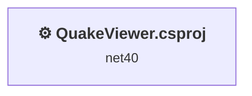
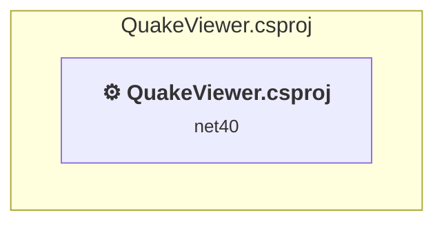

# Projects and dependencies analysis

This document provides a comprehensive overview of the projects and their dependencies in the context of upgrading to .NETCoreApp,Version=v8.0.

## Table of Contents

- [Executive Summary](#executive-Summary)
  - [Highlevel Metrics](#highlevel-metrics)
  - [Projects Compatibility](#projects-compatibility)
  - [Package Compatibility](#package-compatibility)
  - [API Compatibility](#api-compatibility)
- [Aggregate NuGet packages details](#aggregate-nuget-packages-details)
- [Top API Migration Challenges](#top-api-migration-challenges)
  - [Technologies and Features](#technologies-and-features)
  - [Most Frequent API Issues](#most-frequent-api-issues)
- [Projects Relationship Graph](#projects-relationship-graph)
- [Project Details](#project-details)

  - [QuakeViewer\QuakeViewer.csproj](#quakeviewerquakeviewercsproj)

## Executive Summary

### Highlevel Metrics

| Metric | Count | Status |
| :--- | :---: | :--- |
| Total Projects | 1 | All require upgrade |
| Total NuGet Packages | 0 | All compatible |
| Total Code Files | 26 |  |
| Total Code Files with Incidents | 12 |  |
| Total Lines of Code | 1932 |  |
| Total Number of Issues | 990 |  |
| Estimated LOC to modify | 988+ | at least 51.1% of codebase |

### Projects Compatibility

| Project | Target Framework | Difficulty | Package Issues | API Issues | Est. LOC Impact | Description |
| :--- | :---: | :---: | :---: | :---: | :---: | :--- |
| [QuakeViewer\QuakeViewer.csproj](#quakeviewerquakeviewercsproj) | net40 | 🟡 Medium | 0 | 988 | 988+ | ClassicWinForms, Sdk Style = False |

### Package Compatibility

| Status | Count | Percentage |
| :--- | :---: | :---: |
| ✅ Compatible | 0 | 0.0% |
| ⚠️ Incompatible | 0 | 0.0% |
| 🔄 Upgrade Recommended | 0 | 0.0% |
| ***Total NuGet Packages*** | ***0*** | ***100%*** |

### API Compatibility

| Category | Count | Impact |
| :--- | :---: | :--- |
| 🔴 Binary Incompatible | 941 | High - Require code changes |
| 🟡 Source Incompatible | 47 | Medium - Needs re-compilation and potential conflicting API error fixing |
| 🔵 Behavioral change | 0 | Low - Behavioral changes that may require testing at runtime |
| ✅ Compatible | 1589 |  |
| ***Total APIs Analyzed*** | ***2577*** |  |

## Aggregate NuGet packages details

| Package | Current Version | Suggested Version | Projects | Description |
| :--- | :---: | :---: | :--- | :--- |

## Top API Migration Challenges

### Technologies and Features

| Technology | Issues | Percentage | Migration Path |
| :--- | :---: | :---: | :--- |
| Windows Forms | 941 | 95.2% | Windows Forms APIs for building Windows desktop applications with traditional Forms-based UI that are available in .NET on Windows. Enable Windows Desktop support: Option 1 (Recommended): Target net9.0-windows; Option 2: Add <UseWindowsDesktop>true</UseWindowsDesktop>; Option 3 (Legacy): Use Microsoft.NET.Sdk.WindowsDesktop SDK. |
| GDI+ / System.Drawing | 45 | 4.6% | System.Drawing APIs for 2D graphics, imaging, and printing that are available via NuGet package System.Drawing.Common. Note: Not recommended for server scenarios due to Windows dependencies; consider cross-platform alternatives like SkiaSharp or ImageSharp for new code. |
| Legacy Configuration System | 2 | 0.2% | Legacy XML-based configuration system (app.config/web.config) that has been replaced by a more flexible configuration model in .NET Core. The old system was rigid and XML-based. Migrate to Microsoft.Extensions.Configuration with JSON/environment variables; use System.Configuration.ConfigurationManager NuGet package as interim bridge if needed. |

### Most Frequent API Issues

| API | Count | Percentage | Category |
| :--- | :---: | :---: | :--- |
| T:System.Windows.Forms.Label | 105 | 10.6% | Binary Incompatible |
| T:System.Windows.Forms.TabPage | 33 | 3.3% | Binary Incompatible |
| T:System.Windows.Forms.ToolStripMenuItem | 26 | 2.6% | Binary Incompatible |
| T:System.Windows.Forms.GroupBox | 24 | 2.4% | Binary Incompatible |
| P:System.Windows.Forms.Control.Name | 23 | 2.3% | Binary Incompatible |
| P:System.Windows.Forms.Control.Size | 23 | 2.3% | Binary Incompatible |
| T:System.Windows.Forms.AnchorStyles | 23 | 2.3% | Binary Incompatible |
| T:System.Windows.Forms.ToolStripContainer | 22 | 2.2% | Binary Incompatible |
| T:System.Windows.Forms.Control.ControlCollection | 22 | 2.2% | Binary Incompatible |
| P:System.Windows.Forms.Control.Controls | 22 | 2.2% | Binary Incompatible |
| M:System.Windows.Forms.Control.ControlCollection.Add(System.Windows.Forms.Control) | 22 | 2.2% | Binary Incompatible |
| T:System.Windows.Forms.DockStyle | 21 | 2.1% | Binary Incompatible |
| T:System.Windows.Forms.SplitContainer | 20 | 2.0% | Binary Incompatible |
| P:System.Windows.Forms.Control.Location | 20 | 2.0% | Binary Incompatible |
| T:System.Drawing.Bitmap | 19 | 1.9% | Source Incompatible |
| P:System.Windows.Forms.Control.TabIndex | 19 | 1.9% | Binary Incompatible |
| T:System.Windows.Forms.TreeNode | 19 | 1.9% | Binary Incompatible |
| T:System.Windows.Forms.TabControl | 16 | 1.6% | Binary Incompatible |
| T:System.Windows.Forms.MenuStrip | 16 | 1.6% | Binary Incompatible |
| T:System.Windows.Forms.PictureBox | 15 | 1.5% | Binary Incompatible |
| T:System.Windows.Forms.ToolStrip | 13 | 1.3% | Binary Incompatible |
| M:System.Windows.Forms.Control.ResumeLayout(System.Boolean) | 13 | 1.3% | Binary Incompatible |
| P:System.Windows.Forms.Label.Text | 13 | 1.3% | Binary Incompatible |
| P:System.Windows.Forms.Control.Visible | 13 | 1.3% | Binary Incompatible |
| M:System.Windows.Forms.Control.SuspendLayout | 13 | 1.3% | Binary Incompatible |
| T:System.Windows.Forms.TreeNodeCollection | 13 | 1.3% | Binary Incompatible |
| T:System.Windows.Forms.TextBox | 12 | 1.2% | Binary Incompatible |
| T:System.Windows.Forms.ToolStripButton | 11 | 1.1% | Binary Incompatible |
| T:System.Windows.Forms.ImageList | 10 | 1.0% | Binary Incompatible |
| T:System.Windows.Forms.Keys | 10 | 1.0% | Binary Incompatible |
| T:System.Windows.Forms.ScrollBars | 9 | 0.9% | Binary Incompatible |
| T:System.Windows.Forms.StatusStrip | 9 | 0.9% | Binary Incompatible |
| P:System.Windows.Forms.Label.AutoSize | 9 | 0.9% | Binary Incompatible |
| M:System.Windows.Forms.Label.#ctor | 9 | 0.9% | Binary Incompatible |
| P:System.Windows.Forms.TreeView.Nodes | 9 | 0.9% | Binary Incompatible |
| T:System.Windows.Forms.OpenFileDialog | 7 | 0.7% | Binary Incompatible |
| M:System.Windows.Forms.Control.PerformLayout | 7 | 0.7% | Binary Incompatible |
| T:System.Windows.Forms.SplitterPanel | 7 | 0.7% | Binary Incompatible |
| T:System.Windows.Forms.ToolStripSeparator | 6 | 0.6% | Binary Incompatible |
| P:System.Windows.Forms.TreeViewEventArgs.Node | 6 | 0.6% | Binary Incompatible |
| T:System.Windows.Forms.ToolStripPanel | 5 | 0.5% | Binary Incompatible |
| P:System.Windows.Forms.ToolStripContainer.TopToolStripPanel | 5 | 0.5% | Binary Incompatible |
| F:System.Windows.Forms.DockStyle.Fill | 5 | 0.5% | Binary Incompatible |
| P:System.Windows.Forms.ToolStripItem.Size | 5 | 0.5% | Binary Incompatible |
| P:System.Windows.Forms.ToolStripItem.Name | 5 | 0.5% | Binary Incompatible |
| P:System.Windows.Forms.TreeNodeCollection.Item(System.Int32) | 5 | 0.5% | Binary Incompatible |
| P:System.Windows.Forms.TextBoxBase.ReadOnly | 4 | 0.4% | Binary Incompatible |
| P:System.Windows.Forms.SplitContainer.Panel2 | 4 | 0.4% | Binary Incompatible |
| T:System.Windows.Forms.ToolStripContentPanel | 4 | 0.4% | Binary Incompatible |
| P:System.Windows.Forms.ToolStripContainer.ContentPanel | 4 | 0.4% | Binary Incompatible |

## Projects Relationship Graph

Legend:
📦 SDK-style project
⚙️ Classic project

## Project Details

### QuakeViewer\QuakeViewer.csproj

#### Project Info

- **Current Target Framework:** net40
- **Proposed Target Framework:** net8.0-windows
- **SDK-style**: False
- **Project Kind:** ClassicWinForms
- **Dependencies**: 0
- **Dependants**: 0
- **Number of Files**: 28
- **Number of Files with Incidents**: 12
- **Lines of Code**: 1932
- **Estimated LOC to modify**: 988+ (at least 51.1% of the project)

#### Dependency Graph

Legend:
📦 SDK-style project
⚙️ Classic project

### API Compatibility

| Category | Count | Impact |
| :--- | :---: | :--- |
| 🔴 Binary Incompatible | 941 | High - Require code changes |
| 🟡 Source Incompatible | 47 | Medium - Needs re-compilation and potential conflicting API error fixing |
| 🔵 Behavioral change | 0 | Low - Behavioral changes that may require testing at runtime |
| ✅ Compatible | 1589 |  |
| ***Total APIs Analyzed*** | ***2577*** |  |

#### Project Technologies and Features

| Technology | Issues | Percentage | Migration Path |
| :--- | :---: | :---: | :--- |
| Legacy Configuration System | 2 | 0.2% | Legacy XML-based configuration system (app.config/web.config) that has been replaced by a more flexible configuration model in .NET Core. The old system was rigid and XML-based. Migrate to Microsoft.Extensions.Configuration with JSON/environment variables; use System.Configuration.ConfigurationManager NuGet package as interim bridge if needed. |
| GDI+ / System.Drawing | 45 | 4.6% | System.Drawing APIs for 2D graphics, imaging, and printing that are available via NuGet package System.Drawing.Common. Note: Not recommended for server scenarios due to Windows dependencies; consider cross-platform alternatives like SkiaSharp or ImageSharp for new code. |
| Windows Forms | 941 | 95.2% | Windows Forms APIs for building Windows desktop applications with traditional Forms-based UI that are available in .NET on Windows. Enable Windows Desktop support: Option 1 (Recommended): Target net9.0-windows; Option 2: Add <UseWindowsDesktop>true</UseWindowsDesktop>; Option 3 (Legacy): Use Microsoft.NET.Sdk.WindowsDesktop SDK. |

